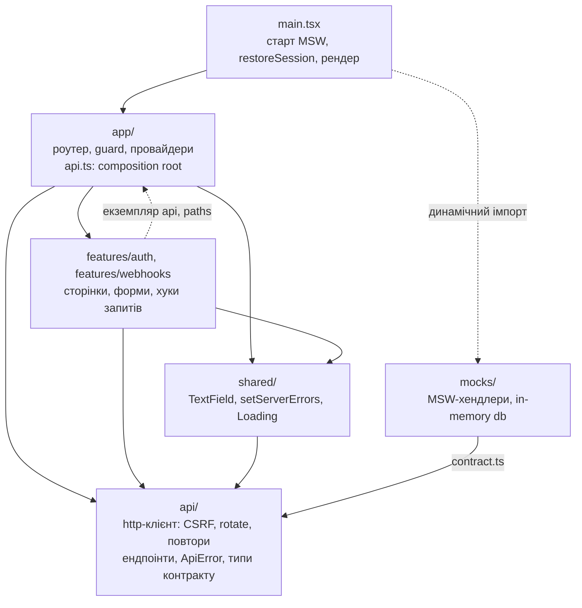
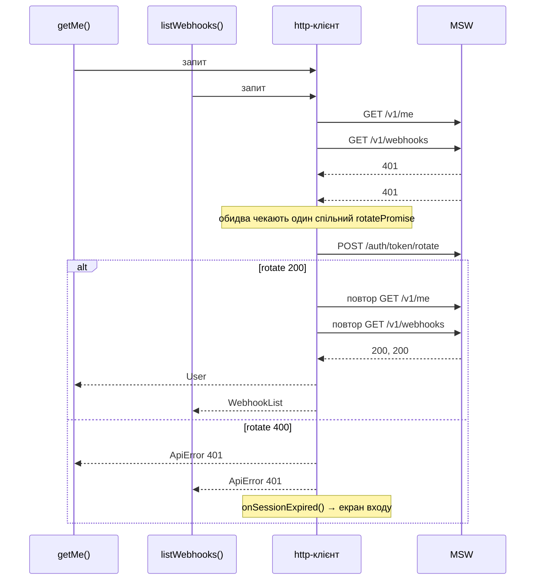

# Smart Sender: вебхуки (тестове завдання)

Застосунок із трьох екранів: вхід, список вебхуків з пагінацією та пошуком, редагування вебхука. API імітує MSW за контрактом із завдання. Сесію зберігає мок, а клієнт не бачить її токенів, як у випадку з HttpOnly-cookie.

**Стек:** React 19, TypeScript (strict + `noUncheckedIndexedAccess`), Vite, React Router, TanStack Query v5, react-hook-form + zod, MSW 2, Vitest.

## Швидкий старт

Потрібні Node 22 (є `.nvmrc`, тож достатньо `nvm use`) і pnpm. Якщо pnpm немає, встановіть його через `npm install -g pnpm` або `corepack enable`.

```bash
pnpm install
pnpm dev     # http://localhost:5173
pnpm test    # Vitest + msw/node
```

Інші перевірки: `pnpm lint`, `pnpm typecheck`, `pnpm build`.

**Тестові облікові дані:** `demo@example.com` / `secret123`

## Як перевірити вручну

1. **Rotate.** Увійдіть, зачекайте понад 30 с і перегорніть сторінку списку. У Network буде `401` → `POST /auth/token/rotate` → повтор запиту, а сесія триває.
2. **«Сесія закінчилась».** Працює лише в `pnpm dev`. Виконайте в консолі браузера:
   ```js
   const { api } = await import('/src/app/api.ts');
   await api.signOut();
   ```
   Сервер відкликає сесію, але застосунок про це ще не знає. Перегорніть сторінку: `401` → rotate → `400` → екран входу з повідомленням про закінчення сесії.
3. **422 біля поля.** Перейменуйте будь-який вебхук на «Telegram: Order paid». Ця назва вже зайнята, тому під полем Name з'явиться «The name has already been taken.».
4. **Перезавантаження.** Мок тримає сесію в пам'яті, тож після перезавантаження потрібно увійти знову (ТЗ це дозволяє). Після входу застосунок повертає на ту саму URL з тими самими `page` і `search`.

## Архітектура

Стрілка означає «імпортує».



- **`api/` не знає про React і роутер.** Про завершення сесії він повідомляє через переданий йому `onSessionExpired`, а UI вирішує, що робити далі.
- **`app/api.ts` є composition root.** Тут створюється єдиний екземпляр `api` і зв'язується зі стором сесії та `queryClient`. Тому фічі імпортують `api` з `app/` (пунктир на схемі). Для застосунку такого масштабу це простіше, ніж DI через контекст.
- **Мок і клієнт мають спільні типи** з `api/contract.ts`, тож розбіжність між ними ловить компілятор.

### Де що шукати

| Вимога | Файли |
|---|---|
| Сесія, rotate, повтори, CSRF | `src/api/http.ts` |
| login → issue → `/v1/me` | `signIn` у `src/api/endpoints.ts` |
| Стан сесії, завершення сесії, вихід | `src/features/auth/sessionStore.ts`, `src/app/api.ts`, `src/features/auth/useSignOut.ts` |
| Fingerprint | `src/features/auth/fingerprint.ts` |
| Guard і повернення після входу | `src/app/RequireAuth.tsx`, `src/features/auth/redirect.ts` |
| Список: URL, пошук, пагінація | `src/features/webhooks/useWebhookListParams.ts`, `listParams.ts`, `SearchField.tsx` |
| Редагування й оновлення кешу | `src/features/webhooks/WebhookForm.tsx`, `useUpdateWebhook.ts` |
| Помилки 422 біля полів | `src/shared/setServerErrors.ts` |
| Мок API | `src/mocks/handlers.ts`, `src/mocks/db.ts` |
| Тест із ТЗ | `src/api/http.test.ts` |

## Ключові рішення

### Сесія і повтори запитів



- **Один спільний rotate.** Усі запити, що отримали 401, поки rotate триває, чекають той самий проміс.
- **Рівно один повтор.** Повторний 401 після rotate або помилка самого rotate завершують сесію через `onSessionExpired`, а не запускають новий цикл.
- **`skipAuthRetry`.** Rotate, login, issue і revoke не обробляють 401 через rotate, тож rotate ніколи не запускає новий rotate.
- **Лічильник поколінь сесії.** Кожен запит запам'ятовує покоління сесії на момент відправки. Якщо його 401 прийшов уже після завершеного rotate, запит просто повторюється, без другого rotate.
- **Токен не виходить за межі `signIn`.** `signIn` виконує login → issue → `/v1/me` і повертає лише користувача. `device_session_token` існує тільки як локальна змінна всередині функції і не потрапляє ні в `mutation.data`, ні в кеш, ні в storage.
- **Fingerprint.** 16 випадкових байтів → 32 hex-символи в localStorage. Зіпсоване значення замінюється новим, інакше вхід зламався б назавжди.

### CSRF

- **`GET /csrf` перед першим запитом будь-якого типу**, через один спільний проміс: паралельні запити на старті роблять один `GET /csrf`. Невдале завантаження не кешується, наступний запит спробує знову.
- **419:** токен перезавантажується (паралельні 419 ділять одне перезавантаження), і запит повторюється не більше одного разу.

### Стан сесії в UI

- **Сесія як union** `checking | authenticated | anonymous(reason)` у зовнішньому сторі (`useSyncExternalStore`). Користувач живе тут, а не в кеші `/v1/me`, тож не зникає після `queryClient.clear()`.
- **Одна перевірка в `handleSessionExpired`:** обробник спрацьовує лише для `authenticated`. Це робить його ідемпотентним (кілька 401 за одне завершення сесії) і відрізняє «ще не увійшов» на старті від «сесія закінчилась».
- **Старт:** `restoreSession()` викликає `/v1/me` без `await` перед рендером, тож застосунок одразу показує «Loading…», а не білий екран.
- **Повернення після входу:** після перезавантаження або закінчення сесії застосунок повертає на початкову URL. Після явного виходу відкривається список з початку.
- **Вихід:** revoke, потім очищення стану й кешу, навіть якщо revoke завершився помилкою.

### Список і URL

- **URL як єдине джерело правди** для `page` і `search`, без копії у стейті. Тому перезавантаження і «назад» / «вперед» відновлюють список без додаткового коду.
- **Нормалізація:** некоректна `page` (`abc`, `0`) веде на першу сторінку, завелика на останню. Обидва переходи через `replace`, без запису в історії.
- **Пошук:** debounce 300 мс, скидання на першу сторінку. Поле синхронізується з URL при «назад» / «вперед», але не зрізає пробіл, поки користувач друкує.
- **`keepPreviousData`:** таблиця лишається на екрані під час переходів, а пагінація на цей час блокується. Якщо падає фонове оновлення, рядки лишаються, а над ними з'являється банер з Retry.

### Форми та помилки

- **Клієнтська валідація (RHF + zod)** дублює правила сервера для миттєвого відгуку, але джерелом правди лишається сервер.
- **`setServerErrors`:** помилки 422 з `payload` ставляться на поля через `setError`. Невідомі поля (наприклад, `captcha`), інші статуси й мережеві помилки показуються як загальна помилка форми.
- **Форма редагування не зникає**, якщо падає фоновий refetch: незбережені зміни лишаються, а над формою з'являється банер з Retry.

### Кеш даних

- **Retry у TanStack Query:** 4xx не повторюються (401 уже обробив http-клієнт), мережеві помилки й 5xx повторюються до двох разів.
- **Після збереження** відповідь PUT кладеться в кеш деталей, а рядок замінюється в усіх закешованих сторінках списку. Потім списки інвалідуються, бо перейменування може змінити результати пошуку. Перехід на список через `replace`, тож «назад» не відкриває збережену форму знову.
- **MSW вантажиться динамічним імпортом**, окремим чанком, і не потрапляє в основний бандл.

## Тести

`pnpm test` запускає 13 тестів.

`src/api/http.test.ts` (Vitest + `msw/node`). Трафік рахується через події MSW, тобто так, як його бачить сервер, а не через внутрішній стан клієнта:

1. **Тест із ТЗ:** два паралельні запити отримують 401 → rotate виконується рівно один раз → обидва повтори успішні. Також перевіряється, що всі запити мають `X-Requested-With`.
2. **Невдалий rotate:** сесію відкликано, обидва запити отримують `ApiError 401`, а `onSessionExpired` викликається рівно один раз.
3. **Пізній 401:** відповідь приходить уже після завершеного rotate, і запит повторюється без другого rotate.

Тести перевірені мутаціями: якщо прибрати дедуплікацію rotate (`??=`), падають тести 1–2; якщо прибрати перевірку покоління сесії, падає тест 3.

`src/features/webhooks/listParams.test.ts`: розбір параметрів списку з URL і їхня канонічна форма.

## Припущення та відхилення від контракту

| Ситуація | Рішення |
|---|---|
| Логін без `X-Captcha-Token` | 422 на полі `captcha`, бо для login контракт дозволяє лише 200 або 422. Клієнт шле заглушку, у реальному застосунку токен дав би віджет капчі. |
| Невірний email або пароль | 422 з однаковим повідомленням на полі `password`, щоб відповідь не видавала, які акаунти існують. |
| Rotate після закінчення 30 с | 200, доки сесію не відкликали, інакше сценарій «401 → rotate» неможливий. 400 лише до issue, після revoke або з чужим fingerprint. |
| Issue з невірним токеном або fingerprint | 422. |
| Будь-яка помилка rotate, включно з мережевою | Завершує сесію, як вимагає ТЗ. У реальному застосунку мережеву помилку варто було б відрізняти від невалідної сесії. |
| `X-Requested-With` | Клієнт шле завжди, тест це перевіряє. Мок не перевіряє, бо контракт не визначає статус для запиту без цього заголовка. |
| PUT неіснуючого вебхука | 404, хоча контракт для PUT перелічує лише 200, 401 і 422. |
| PUT з назвою іншого вебхука | 422 на `name` (порівняння після trim, без урахування регістру). Це розширення моку: клієнт уже перевіряє формат, тож інакше серверну 422 в інтерфейсі не побачити. |
| Історія браузера | Кожна зміна сторінки й кожен застосований пошук додають запис, нормалізація URL робиться через `replace`. |
| Редагування | Окрема сторінка `/webhooks/:id`. Поле `active` лише відображається, бо PUT приймає тільки `name` і `url`. |
| Мок | Увімкнений у всіх режимах, бо справжнього бекенду немає. |

## Що далі

- Захист незбережених змін на сторінці редагування.
- Тести компонентів (React Testing Library + jsdom) і e2e (Playwright). Зараз тестами покриті http-клієнт і чисті функції.
- i18n.
- Env-прапорець для MSW, щоб мок не потрапляв у прод-збірку.

## Використання AI

Код написаний разом із Claude Code. Я підготував бриф з вимогами й обмеженнями, розбив роботу на етапи, затверджував план кожного етапу і переглядав код перед кожним комітом. Плани й код я додатково рев'юїв в окремому чаті з Claude як із другим рецензентом. Так ще на етапі плану ми помітили, що debounce зрізав би пробіл у кінці пошуку, а зіпсований fingerprint у localStorage назавжди ламав би вхід. А вже в коді знайшли, що невдалий фоновий refetch прибирав форму редагування разом із незбереженими змінами. Усі сценарії я перевірив у браузері сам. Рішення й компроміси, описані вище, я прийняв свідомо і можу пояснити кожне з них.
