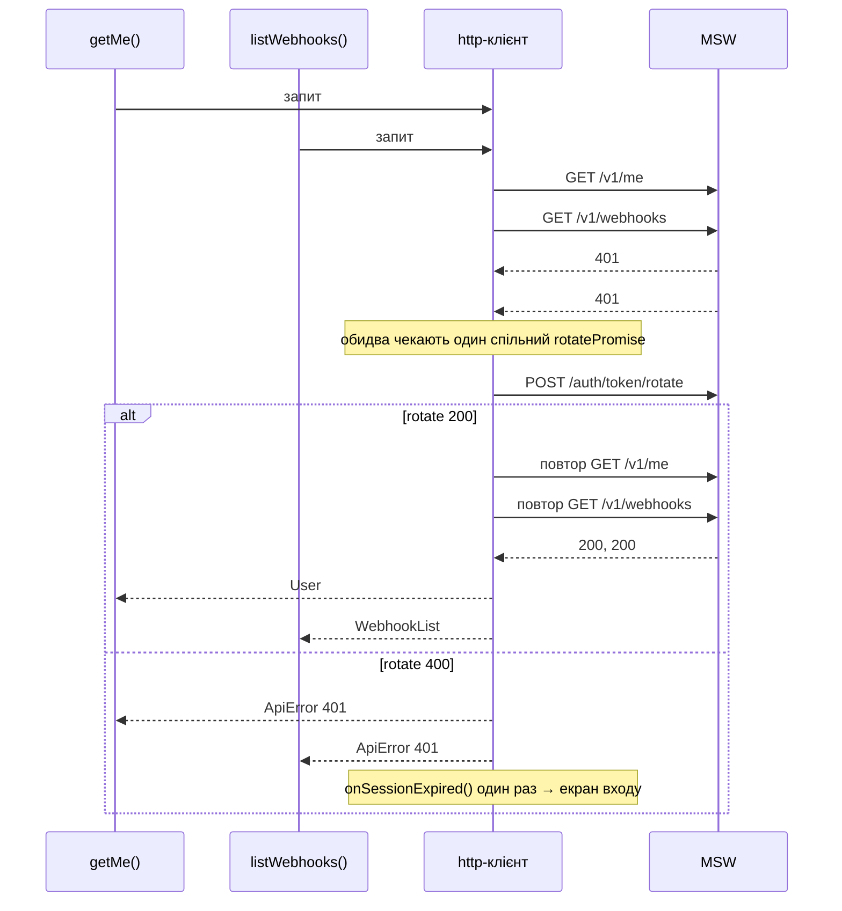

# Smart Sender: вебхуки (тестове завдання)

Застосунок із трьох екранів: вхід, список вебхуків з пагінацією та пошуком, редагування вебхука. API імітує MSW за контрактом із завдання. Сесію зберігає мок, а клієнт не бачить її токенів, як у випадку з HttpOnly-cookie.

**Стек:** React 19, TypeScript (strict + `noUncheckedIndexedAccess`), Vite, React Router, TanStack Query v5, react-hook-form + zod, MSW 2, Vitest. UI-бібліотеку свідомо не підключав: ТЗ оцінює логіку, а не оформлення, а нативні елементи з `label` і `aria-*` дають доступність без зайвих залежностей.

## Швидкий старт

Потрібні Node 22 (є `.nvmrc`) і pnpm (`npm install -g pnpm` або `corepack enable`).

```bash
pnpm install
pnpm dev                          # http://localhost:5173
pnpm test                         # усі тести
pnpm test src/api/http.test.ts    # тести сесії, включно з тестом із ТЗ
```

Інші перевірки: `pnpm lint`, `pnpm typecheck`, `pnpm build`.

**Тестові облікові дані:** `demo@example.com` / `secret123`

## Як перевірити вручну

1. **Rotate.** Увійдіть, зачекайте понад 30 с і перегорніть сторінку. У Network: `401` → `POST /auth/token/rotate` → повтор запиту.
2. **«Сесія закінчилась»** (лише `pnpm dev`). Відкличте сесію з консолі браузера і перегорніть сторінку: `401` → rotate `400` → екран входу з повідомленням.
   ```js
   const { api } = await import('/src/app/api.ts');
   await api.signOut();
   ```
3. **422 біля поля.** Перейменуйте будь-який вебхук на «Telegram: Order paid»: під полем Name з'явиться «The name has already been taken.».
4. **Перезавантаження.** Мок тримає сесію в пам'яті, тож після перезавантаження потрібен повторний вхід. Після нього застосунок повертає на ту саму URL з тими самими `page` і `search`.

## Де що шукати

| Що | Де |
|---|---|
| Сесія, rotate, повтори, CSRF | `src/api/http.ts` |
| login → issue → `/v1/me` | `signIn` у `src/api/endpoints.ts` |
| Стан сесії і реакція на її завершення | `src/features/auth/sessionStore.ts`, `src/app/api.ts` |
| Список: URL, пошук, пагінація | `src/features/webhooks/list/useWebhookListParams.ts`, `useSearchDraft.ts` |
| Редагування, 422 біля полів | `src/features/webhooks/edit/WebhookForm.tsx`, `src/shared/setServerErrors.ts` |
| Мок API | `src/mocks/handlers.ts`, `src/mocks/db.ts` |

Фіча вебхуків розкладена за сценаріями, які відповідають маршрутам: `list/` і `edit/`, а спільні `queryKeys.ts` і `listLink.ts` лежать у корені фічі. Шар `api/` не знає про React і роутер: про завершення сесії він повідомляє через `onSessionExpired`. `src/app/api.ts` є composition root: тут створюється єдиний екземпляр `api` і зв'язується зі стором сесії та `queryClient`, тому фічі імпортують `api` з `app/`. Мок і клієнт мають спільні типи з `api/contract.ts`, тож розбіжність у формі даних ловить компілятор.

## Ключові рішення

### Сесія і повтори запитів



- **Один спільний rotate і рівно один повтор.** Rotate, login, issue і revoke позначені `skipAuthRetry`, тож rotate ніколи не запускає rotate. Повторний 401 або помилка rotate завершують сесію.
- **Покоління сесії.** Кожен запит запам'ятовує покоління на момент відправки. Пізній 401, що прийшов після успішного rotate, просто повторюється. Пізній 401 із уже завершеної сесії одразу падає, без нового rotate. Тому `onSessionExpired` викликається рівно раз на одне завершення сесії.
- **CSRF.** `GET /csrf` виконується перед першим запитом будь-якого типу через один спільний проміс. На 419 токен перезавантажується один раз для всіх паралельних запитів, а запит повторюється не більше одного разу.
- **Токен не виходить за межі `signIn`.** `device_session_token` живе лише як локальна змінна і не потрапляє ні в `mutation.data`, ні в кеш, ні в storage. Мутація входу з паролем у змінних прибирається з кешу одразу (`gcTime: 0`).

### Стан сесії в UI

- **Сесія як union** `checking | authenticated | anonymous(reason)` у сторі на `useSyncExternalStore`. `handleSessionExpired` спрацьовує лише для `authenticated`, тож старт без сесії не показується як «сесія закінчилась».
- **Повернення після входу** на початкову URL після перезавантаження або закінчення сесії; після явного виходу відкривається список з початку.
- **Вихід** очищає стан і кеш навіть тоді, коли revoke завершився помилкою.

### Список і URL

- **URL як єдине джерело правди** для `page` і `search`: перезавантаження і «назад» / «вперед» відновлюють список без додаткового коду. Некоректна `page` веде на першу сторінку, завелика на останню, обидва переходи через `replace`.
- **Пошук** з debounce 300 мс скидає на першу сторінку і додає в історію один запис на сесію набору, а не по запису на кожну паузу.
- **`keepPreviousData`** тримає таблицю на екрані під час переходів. Якщо фонове оновлення падає, дані лишаються, а над ними з'являється банер з Retry; так само поводиться форма редагування.

### Форми та помилки

- **Клієнтська валідація (RHF + zod)** дублює правила сервера для миттєвого відгуку, але джерелом правди лишається сервер. `setServerErrors` ставить помилки 422 на поля, а невідомі поля, інші статуси й мережеві помилки показує як загальну помилку форми.
- **Після збереження** рядок одразу оновлюється в закешованих списках, потім списки інвалідуються. Перехід на список робиться через `replace`.

## Тести

`pnpm test` запускає 18 тестів. `src/api/http.test.ts` (8 тестів) спостерігає трафік через події MSW, а не через внутрішній стан клієнта:

- тест із ТЗ: два паралельні 401 → один rotate → обидва повтори успішні, у всіх запитах є `X-Requested-With`;
- невдалий rotate і повторний 401 після успішного rotate завершують сесію рівно один раз;
- пізній 401 після успішного rotate повторюється без нового rotate, а пізній 401 із завершеної сесії падає без rotate; нова сесія знову проходить rotate;
- 419: токен перезавантажується один раз, запит повторюється, другий 419 поспіль закінчується помилкою.

Тести перевірені мутаціями: якщо прибрати дедуплікацію rotate, перевірку покоління, ліміт повторів, обробку 419 або `X-Requested-With`, падає щонайменше один тест. `src/features/webhooks/list/listParams.test.ts` (10 тестів) перевіряє розбір параметрів списку з URL.

## Припущення та відхилення від контракту

| Ситуація | Рішення |
|---|---|
| Логін без `X-Captcha-Token` | 422 на полі `captcha` (для login контракт дозволяє лише 200 або 422). Клієнт шле заглушку замість токена віджета капчі. |
| Невірний email або пароль | 422 з однаковим повідомленням на `password`, щоб не видавати, які акаунти існують. |
| Rotate після закінчення 30 с | 200, доки сесію не відкликали, інакше сценарій «401 → rotate» неможливий. 400 до issue, після revoke або з чужим fingerprint. |
| Будь-яка помилка rotate | Завершує сесію, як вимагає ТЗ. У реальному застосунку мережеву помилку варто відрізняти від невалідної сесії. |
| `X-Requested-With` | Клієнт шле завжди, мок не перевіряє: контракт не визначає статус для запиту без нього. |
| PUT неіснуючого вебхука | 404, хоча контракт для PUT перелічує лише 200, 401 і 422. |
| PUT з назвою іншого вебхука | 422 на `name`. Розширення моку: клієнт уже перевіряє формат, тож інакше серверну 422 в UI не побачити. |
| Пошук і `limit` у моку | Мок обрізає пробіли в `search` і приймає будь-який `limit`; клієнт завжди шле обрізаний пошук і `limit=10`. |
| Редагування | Окрема сторінка `/webhooks/:id`; `active` лише відображається, бо PUT приймає тільки `name` і `url`. |
| Мок у збірці | Увімкнений у всіх режимах, бо бекенду немає. Винесений в окремий чанк, тож з env-прапорцем його легко прибрати з прод-збірки. |

## Що далі

- Захист незбережених змін на сторінці редагування.
- Тести компонентів (React Testing Library) і e2e (Playwright).
- Env-прапорець для MSW і i18n.

## Використання AI

Код написаний разом із Claude Code. Я підготував бриф з вимогами й обмеженнями, розбив роботу на етапи, затверджував план кожного етапу і переглядав код перед кожним комітом. Плани й код я додатково рев'юїв в окремому чаті з Claude як із другим рецензентом. Так ще на етапі плану ми помітили, що debounce зрізав би пробіл у кінці пошуку, а зіпсований fingerprint у localStorage назавжди ламав би вхід. Наприкінці я попросив незалежне рев'ю в новій сесії і за ним виправив зайвий rotate після невдалого rotate та засмічення історії пошуком. Усі сценарії я перевірив у браузері сам. Рішення й компроміси, описані вище, я прийняв свідомо і можу пояснити кожне з них.
